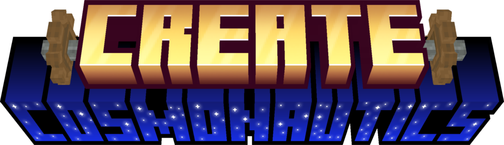

  

## About
Create Cosmonautics expands Create Aeronautics to add space travel through player built rocket ships and physics using Sable. It gives you all the engineering tools to build a rocket, it's up to you to keep it alive in space.

Highly recommended to have [JEI](https://modrinth.com/mod/jei) or some alternative installed with this mod to view recipes and pondering.

## Features

## Installing
This runs on [NeoForge](https://neoforged.net/) only, its dependencies are listed:
- [Create](https://modrinth.com/mod/create)
- [Create Aeronautics](https://modrinth.com/mod/create-aeronautics)
- [Sable](https://modrinth.com/mod/sable)

**Supported Create versions:**
| Create | Create Aeronautics | CAPG |
| :--- | :--- | :--- |
| 6.0.9+ | 1.2.1 | 1.0.0 - latest |